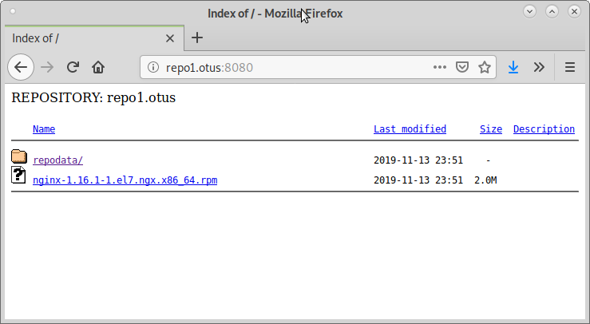

## Занятие 6. Управление пакетами. Дистрибьюция софта  
### Содержание
1. [Описание занятия](#description)  
2. [Домашнее задание](#homework)  
3. [Справочная информация](#info)  
4. [Выполнение](#exec)  
      

## 1. Описание занятия <a name="description"></a>
### Цели
- Как устанавливать софт в Linux. Как собирать из исходников. Репозитории, `yum` и `RPM`.  
- `Docker` как средство дистрибьюции, преимущества и недостатки.  

### Краткое содержание    
- Сборка пакетов из исходников;  
- `RPM`;  
- Сборка собственного `RPM`;
- `mock`;
- `Docker` как дистрибьюция ПО.

### Результаты  
Студент сможет собрать собственный rpm-пакет и разместить его в собственном репозитории.

## 2. Домашнее задание  <a name="homework"></a>
### Постановка задачи  
Размещаем свой `RPM` в своем репозитории.  
1) Создать свой `RPM` (можно взять свое приложение, либо собрать, к примеру, `Apache` с определенными опциями).  
2) Создать свой репозиторий и разместить там свой `RPM`.  
Реализовать это все либо в вагранте, либо развернуть у себя через nginx и дать ссылку на репо.  
3) Реализовать дополнительно пакет через `Docker`.  

### Критерии оценки  
5 - есть rpm-пакет и репозиторий;  
+1 - сделан еще и `Docker`-образ.   

## 3. Справочная информация <a name="info"></a>  
#### Способы распространения ПО в Linux
- `make && make install`;  
- `rpm`, `yum`;  
- `Docker`.

#### RPM-пакеты  
- `src.rpm`, в этих пакетах содержится исходный код программы, патчи и самый главный `spec`-файл, который управляет процессом сборки. Все эти файлы упакованы в `cpio`-архив. Также в пакете присутствует некоторые файлы с информацией.  
- `%{arch}.rpm`, готовые к установке пакеты, в них содержится `cpio`-архив с файлами, которые после установки разложатся по соответствующим каталогам, файлы информации и установочные скрипты. 

#### RPM  
- `rpm -q {name}` — проверить установлен ли пакет `{name}`;  
- `rpm -qi[p] {name}/{pkg}` — показать мета-информацию о пакете;  
- `rpm -qp --queryformat %{VERSION}-%{RELEASE} {pkg}` — формат вывода информации;  
- `rpm -e {name}` — удалить пакет;  
- `rpm -i {pkg}` — установить пакет;  
- `rpm -ql[p] {name}/{pkg}` — вывести список файлов пакета;  
- `rpm -q[p] --scripts` — показать скриптлеты;  
- `rpm -q[p]R` — показать от каких пакетов зависит этот;  
- `rpm -q[p] --provides {name}` — показать ресурсы предоставляемые пакетом;  
- `rpm -qf {file}` — показать какому пакету принадлежит {file};  
- `rpm2cpio {pkg} | cpio -idmv` — распаковать содержимое пакета.  

#### YUM
- `search` — поиск пакета;  
- `install` — установка пакета(ов);  
- `update` — обновление (до версии);  
- `downgrade` — откат до до версии;  
- `check-update` — проверка обновлений;  
- `remove` — удаление пакета;  
- `info` — информация о пакете;  
- `provides` — найти из какого пакета файл;  
- `shell` — CLI.  

#### YUM. Полезные команды
- `yum updateinfo list security all`  
- `yum updateinfo list security installed`  
- `yum -y update --security`  
- `yum update-minimal --security -y`  
- `yum update --cve <CVE>`  
- `yum updateinfo list cves`  
- `yum updateinfo list`  
- `yum  info-sec`  

#### Источники  
- [RPM Packaging Guide](https://rpm-packaging-guide.github.io/)  


## 4. Выполнение <a name="exec"></a> 

Суть выполненного задания состоит в автоматизированном развертывании из [Vagrantfile](https://github.com/che-a/OTUS_LinuxAdministrator/blob/master/lesson_06/Vagrantfile) тестового окружения в составе двух подключенных к одной сети виртуальных машин. Сценарии [srv.sh](https://github.com/che-a/OTUS_LinuxAdministrator/blob/master/lesson_06/srv.sh) и [ws.sh](https://github.com/che-a/OTUS_LinuxAdministrator/blob/master/lesson_06/ws.sh) являются файлами провижининга для `srv.otus` и `ws.otus` соответственно.  

На `srv.otus`:  
- расположено три репозитория `repo1.otus`, `repo2.otus` и `repo3.otus`;  
- развернут веб-сервер `Apache` для просмотра листинга каталога каждого репозитория;  
- в одном из репозиториев располагается собранный из исходных кодов с дополнительными параметрами `RPM`-пакет веб-сервера `Nginx`.  

На `ws.otus`:  
- подключены три вышеуказанных репозитория;  
- установлен и запущен вышеуказанный веб-сервер `Nginx`.  

Для просмотра листинга каталогов необходимо у себя на локальной машине добавить в файл `hosts` следующую строку:
```console
127.0.0.1   repo1.otus repo2.otus repo3.otus
```
и после этого переходить в браузере по следующим адресам:  
```
http://repo1.otus:8080/
http://repo2.otus:8080/
http://repo3.otus:8080/
```
​


Удостовериться в работоспособности собранного из исходных кодов веб-сервера `Nginx` можно по адресу:  
```
http://localhost:8081/
```

Просмотр состояния подключенных репозиториев на `ws.otus`:  
```bash
yum repolist enabled | grep repo[1-3]
```
```console
Failed to set locale, defaulting to C
repo1                     OTUS Linux - Repo 1                                 1
repo2                     OTUS Linux - Repo 2                                 1
repo3                     OTUS Linux - Repo 3                                 0
```
```bash
yum list | grep repo[1-3]
```
```console
Failed to set locale, defaulting to C
nginx.x86_64                                1:1.16.1-1.el7.ngx         @repo1   
percona-release.noarch                      1.0-13                     @repo2   
```
